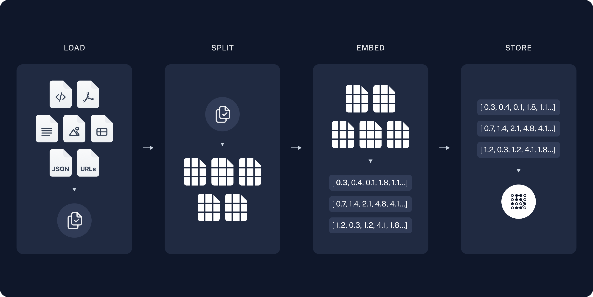

# Retrieval Augmented Generation (RAG)

One of the most powerful applications enabled by LLMs is sophisticated question-answering (Q&A) chatbots. These are applications that can answer questions about specific source information. These applications use a technique known as Retrieval Augmented Generation, or [RAG](/docs/concepts/rag/).

## Overview
A typical RAG application has two main components:

**Indexing**: a pipeline for ingesting data from a source and indexing it. *This usually happens offline.*

**Retrieval and generation**: the actual RAG chain, which takes the user query at run time and retrieves the relevant data from the index, then passes that to the model.

Note: the indexing portion of this tutorial will largely follow the [semantic search tutorial](/docs/tutorials/retrievers).

The most common full sequence from raw data to answer looks like:

### Indexing
1. **Load**: First we need to load our data. This is done with [Document Loaders](/docs/concepts/document_loaders).
2. **Split**: [Text splitters](/docs/concepts/text_splitters) break large `Documents` into smaller chunks. This is useful both for indexing data and passing it into a model, as large chunks are harder to search over and won't fit in a model's finite context window.
3. **Store**: We need somewhere to store and index our splits, so that they can be searched over later. This is often done using a [VectorStore](/docs/concepts/vectorstores) and [Embeddings](/docs/concepts/embedding_models) model.


### Retrieval and generation
4. **Retrieve**: Given a user input, relevant splits are retrieved from storage using a [Retriever](/docs/concepts/retrievers).
5. **Generate**: A [ChatModel](/docs/concepts/chat_models) / [LLM](/docs/concepts/text_llms) produces an answer using a prompt that includes both the question with the retrieved data



Once we've indexed our data, we will use [LangGraph](https://langchain-ai.github.io/langgraph/) as our orchestration framework to implement the retrieval and generation steps.

## Detailed walkthrough

Let’s go through the above code step-by-step to really understand what’s going on.

## 1. Indexing

**NOTE:**

This section is an abbreviated version of the content in the [semantic search tutorial](/docs/tutorials/retrievers).
If you're comfortable with [document loaders](/docs/concepts/document_loaders), [embeddings](/docs/concepts/embedding_models), and [vector stores](/docs/concepts/vectorstores), feel free to skip to the next section on [retrieval and generation](/docs/tutorials/rag/#orchestration).

### 1.1 Loading documents

We need to first load the blog post contents. We can use [DocumentLoaders](/docs/concepts/document_loaders) for this, which are objects that load in data from a source and return a list of [Document](https://python.langchain.com/api_reference/core/documents/langchain_core.documents.base.Document.html) objects.

In this case we’ll use the [WebBaseLoader](/docs/integrations/document_loaders/web_base), which uses `urllib` to load HTML from web URLs and `BeautifulSoup` to parse it to text. We can customize the HTML -\> text parsing by passing in parameters into the `BeautifulSoup` parser via `bs_kwargs` (see [BeautifulSoup docs](https://beautiful-soup-4.readthedocs.io/en/latest/#beautifulsoup)).
In this case only HTML tags with class “post-content”, “post-title”, or “post-header” are relevant, so we’ll remove all others.

### Go deeper

`DocumentLoader`: Object that loads data from a source as list of `Documents`.

- [Docs](/docs/how_to#document-loaders):
  Detailed documentation on how to use `DocumentLoaders`.
- [Integrations](/docs/integrations/document_loaders/): 160+
  integrations to choose from.
- [Interface](https://python.langchain.com/api_reference/core/document_loaders/langchain_core.document_loaders.base.BaseLoader.html):
  API reference for the base interface.

### 1.2 Splitting documents

Our loaded document is over 42k characters which is too long to fit into the context window of many models. Even for those models that could fit the full post in their context window, models can struggle to find information in very long inputs.

To handle this we’ll split the `Document` into chunks for embedding and vector storage. This should help us retrieve only the most relevant parts of the blog post at run time.


As in the [semantic search tutorial](/docs/tutorials/retrievers), we use a [RecursiveCharacterTextSplitter](/docs/how_to/recursive_text_splitter), which will recursively split the document using common separators like new lines until each chunk is the appropriate size. This is the recommended text splitter for generic text use cases.

#### Go deeper

`TextSplitter`: Object that splits a list of `Document`s into smaller chunks. Subclass of `DocumentTransformer`s.

- Learn more about splitting text using different methods by reading the [how-to docs](/docs/how_to#text-splitters)
- [Code (py or js)](/docs/integrations/document_loaders/source_code)
- [Scientific papers](/docs/integrations/document_loaders/grobid)
- [Interface](https://python.langchain.com/api_reference/text_splitters/base/langchain_text_splitters.base.TextSplitter.html): API reference for the base interface.

`DocumentTransformer`: Object that performs a transformation on a list of `Document` objects.

- [Docs](/docs/how_to#text-splitters): Detailed documentation on how to use `DocumentTransformers`
- [Integrations](/docs/integrations/document_transformers/)
- [Interface](https://python.langchain.com/api_reference/core/documents/langchain_core.documents.transformers.BaseDocumentTransformer.html): API reference for the base interface.

### 1.3 Storing documents

Now we need to index our 66 text chunks so that we can search over them at runtime. Following the [semantic search tutorial](/docs/tutorials/retrievers), our approach is to [embed](/docs/concepts/embedding_models/) the contents of each document split and insert these embeddings into a [vector store](/docs/concepts/vectorstores/). Given an input query, we can then use vector search to retrieve relevant documents.

We can embed and store all of our document splits in a single command using the vector store and embeddings model selected at the [start of the tutorial](/docs/tutorials/rag/#components).

#### Go deeper

`Embeddings`: Wrapper around a text embedding model, used for converting text to embeddings.

- [Docs](/docs/how_to/embed_text): Detailed documentation on how to use embeddings.
- [Integrations](/docs/integrations/text_embedding/): 30+ integrations to choose from.
- [Interface](https://python.langchain.com/api_reference/core/embeddings/langchain_core.embeddings.Embeddings.html): API reference for the base interface.

`VectorStore`: Wrapper around a vector database, used for storing and querying embeddings.

- [Docs](/docs/how_to/vectorstores): Detailed documentation on how to use vector stores.
- [Integrations](/docs/integrations/vectorstores/): 40+ integrations to choose from.
- [Interface](https://python.langchain.com/api_reference/core/vectorstores/langchain_core.vectorstores.base.VectorStore.html): API reference for the base interface.

This completes the **Indexing** portion of the pipeline. At this point we have a query-able vector store containing the chunked contents of our blog post. Given a user question, we should ideally be able to return the snippets of the blog post that answer the question.

## 2. Retrieval and Generation

Now let’s write the actual application logic. We want to create a simple application that takes a user question, searches for documents relevant to that question, passes the retrieved documents and initial question to a model, and returns an answer.

For generation, we will use the chat model selected at the [start of the tutorial](/docs/tutorials/rag/#components).

We’ll use a prompt for RAG that is checked into the LangChain prompt hub ([here](https://smith.langchain.com/hub/rlm/rag-prompt)).

We get streamlined deployments via [LangGraph Platform](https://langchain-ai.github.io/langgraph/concepts/langgraph_platform/).
- LangSmith will automatically trace the steps of our application together.
- We can easily add key features to our application, including [persistence](https://langchain-ai.github.io/langgraph/concepts/persistence/) and [human-in-the-loop approval](https://langchain-ai.github.io/langgraph/concepts/human_in_the_loop/), with minimal code changes.

To use LangGraph, we need to define three things:

1. The state of our application;
2. The nodes of our application (i.e., application steps);
3. The "control flow" of our application (e.g., the ordering of the steps).

#### 2.1 State:

The [state](https://langchain-ai.github.io/langgraWe'll use [LangGraph](https://langchain-ai.github.io/langgraph/) to tie together the retrieval and generation steps into a single application. This will bring a number of benefits:

- We can define our application logic once and automatically support multiple invocation modes, including streaming, async, and batched calls.
- ph/concepts/low_level/#state) of our application controls what data is input to the application, transferred between steps, and output by the application. It is typically a `TypedDict`, but can also be a [Pydantic BaseModel](https://langchain-ai.github.io/langgraph/how-tos/state-model/).

For a simple RAG application, we can just keep track of the input question, retrieved context, and generated answer.

#### 2.2 Nodes (application steps)

Let's start with a simple sequence of two steps: retrieval and generation.

Our retrieval step simply runs a similarity search using the input question, and the generation step formats the retrieved context and original question into a prompt for the chat model.

#### 2.3 Control flow

Finally, we compile our application into a single `graph` object. In this case, we are just connecting the retrieval and generation steps into a single sequence.
<summary>Do I need to use LangGraph?</summary>

LangGraph is not required to build a RAG application. Indeed, we can implement the same application logic through invocations of the individual components:

```python
question = "..."

retrieved_docs = vector_store.similarity_search(question)
docs_content = "\n\n".join(doc.page_content for doc in retrieved_docs)
prompt = prompt.invoke({"question": question, "context": docs_content})
answer = llm.invoke(prompt)
```

The benefits of LangGraph include:

- Support for multiple invocation modes: this logic would need to be rewritten if we wanted to stream output tokens, or stream the results of individual steps;
- Automatic support for tracing via [LangSmith](https://docs.smith.langchain.com/) and deployments via [LangGraph Platform](https://langchain-ai.github.io/langgraph/concepts/langgraph_platform/);
- Support for persistence, human-in-the-loop, and other features.

Many use-cases demand RAG in a conversational experience, such that a user can receive context-informed answers via a stateful conversation. As we will see in [Part 2](/docs/tutorials/qa_chat_history) of the tutorial, LangGraph's management and persistence of state simplifies these applications enormously.
